Creating a private CI with Strider

  Continuous integration and deployment servers are vital to the development process. Especially for web applications, being able to immediately test your branches and automatically deploy them is invaluable. [Strider](http://stridercd.com) is a new open-souce continuous deployment suite written in [nodejs](http://nodejs.org). While it is quite new and not without quirks, it features web hooks, email alerts, full [Github](http://github.com) integration, account management, [Heroku](http://heroku.com) deployment, and [Sauce Labs](http://saucelabs.com) integration.

  This article is a quick tutorial on how to set up your own in-house installation of Strider on a [Digital Ocean](http://digitalocean.com) VPS as low as $5/month.

<!-- Content Breaker -->

## Setup DigitalOcean account

  The first step is, if you don't have one already, [register an account on Digital Ocean](http://digitalocean.com/registrations/new). You will be required to enter billing information before you can create any "droplets" (Digital Ocean terminalology for a VPS instance).

## Create a droplet - Ubuntu 13.04 x64

 Now we need to create our droplet that will host the Strider instance. I chose to register a 64 bit [Ubuntu](http://ubuntu.com) 13.04 installation, if only for the easy access to an up-to-date nodejs installation through [Chris Lea's PPA](https://launchpad.net/~chris-lea/+archive/node.js). You can pick any distribution you would like, but you'll have the find the appropriate packages yourself. 

 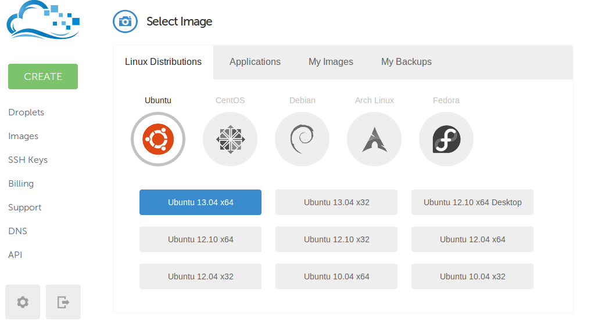

## SSH access

 When your droplet has been provisioned, Digital Ocean will send you an email with your root password. Now you can SSH into the root account of the droplet, and change the password.

 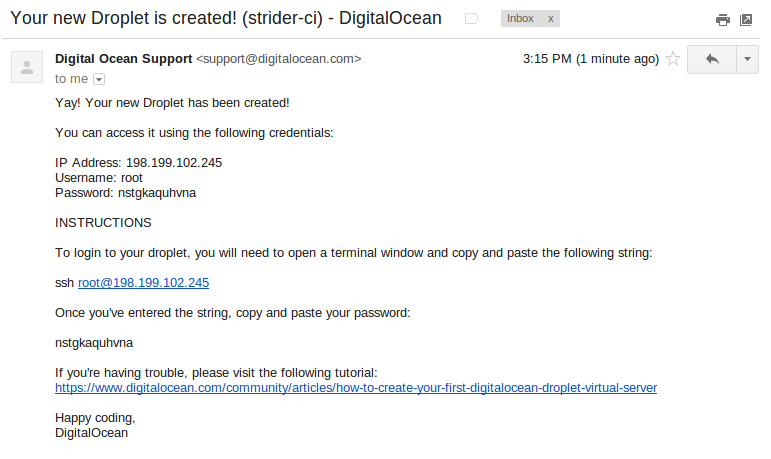

    chris@laptop:~# ssh root@198.199.102.245
    The authenticity of host '198.199.102.245 (198.199.102.245)' can't be established.
    ECDSA key fingerprint is ee:e8:b7:55:dc:e0:cb:ee:99:f1:72:53:62:a2:97:de.
    Are you sure you want to continue connecting (yes/no)? yes
    Warning: Permanently added '198.199.102.245' (ECDSA) to the list of known hosts.
    root@198.199.102.245's password: 

    The programs included with the Ubuntu system are free software;
    the exact distribution terms for each program are described in the
    individual files in /usr/share/doc/*/copyright.

    Ubuntu comes with ABSOLUTELY NO WARRANTY, to the extent permitted by
    applicable law.

    Welcome to Ubuntu 13.04 (GNU/Linux 3.8.0-19-generic x86_64)

     * Documentation:  https://help.ubuntu.com/
    root@strider-ci:~# 

As always, you should change the root password now that we have logged into the droplet:

    root@strider-ci:~# passwd
    Enter new UNIX password: 
    Retype new UNIX password: 
    passwd: password updated successfully
    root@strider-ci:~# 

## Bring the system up-to-date

The droplet might be out of date from the official Ubuntu repository, so let's be sure that we are running the latest updates and software before doing anything:

    root@strider-ci:~# apt-get update
    [ Cut for brevity ]
    root@strider-ci:~# apt-get dist-upgrade
    [ Cut for brevity ]
    root@strider-ci:~# 

Be sure to reboot if necessary. If you do reboot, you will be disconnected from the droplet. Simply reconnect via SSH again once the droplet is back up and running.

    root@strider-ci:~# reboot 
    root@strider-ci:~# 
    Broadcast message from root@strider-ci
        (/dev/pts/0) at 22:23 ...

    The system is going down for reboot NOW!
    Connection to 198.199.102.245 closed by remote host.
    Shared connection to 198.199.102.245 closed.
    chris@laptop:~# ssh root@198.199.102.245
    root@198.199.102.245's password: 
    Welcome to Ubuntu 13.04 (GNU/Linux 3.8.0-19-generic x86_64)

     * Documentation:  https://help.ubuntu.com/
    Last login: Fri Jul 26 22:18:46 2013 from 99.199.116.38
    root@strider-ci:~# 

## Install nodejs

 Since Strider is written in nodejs, and our testing application will be a nodejs application, we are going to need to install nodejs! Ubuntu offers a package for this, but due to the constant development of nodejs it is very outdated. Instead, we will register a new repository via Chris Lea's PPA.

    root@strider-ci:~# apt-get install software-properties-common 
    [ Cut for brevity ]
    root@strider-ci:~# add-apt-repository ppa:chris-lea/node.js
    You are about to add the following PPA to your system:
     Evented I/O for V8 javascript. Nodejs's goal is to provide an easy way to build scalable network programs
     More info: https://launchpad.net/~chris-lea/+archive/node.js
    Press [ENTER] to continue or ctrl-c to cancel adding it
    gpg: keyring `/tmp/tmps6w7ka/secring.gpg' created
    gpg: keyring `/tmp/tmps6w7ka/pubring.gpg' created
    gpg: requesting key C7917B12 from hkp server keyserver.ubuntu.com
    gpg: /tmp/tmps6w7ka/trustdb.gpg: trustdb created
    gpg: key C7917B12: public key "Launchpad chrislea" imported
    gpg: Total number processed: 1
    gpg:               imported: 1  (RSA: 1)
    OK
    root@strider-ci:~# 

 Now let us install nodejs! A signifigant amount of nodejs dependencies we will be using require compilation, so we will also install g++ and make. Remember to update the cache first as we have recently added a repository.

    root@strider-ci:~# apt-get update
    [ Cut for brevity ]
    root@strider-ci:~# apt-get install nodejs g++ make
    [ Cut for brevity ]
    root@strider-ci:~# 

## Install git

 We are also going to need [git](http://gitscm.com) for downloading content through [npm](http://npmjs.org), nodejs's package manager, and for Github integration with Strider.

    root@strider-ci:~# apt-get install git
    [ Cut for brevity]
    root@strider-ci:~# 

## Install Strider

 Now, let's install Strider through npm.

    root@strider-ci:~# npm install -g strider
    [ Cut for brevity ]
    /usr/bin/strider -> /usr/lib/node_modules/strider/bin/strider
    strider@1.3.1 /usr/lib/node_modules/strider
    ├── pw@0.0.4
    ├── cookie@0.0.5
    ├── ansiparse@0.0.5-1
    ├── strider-env@0.1.0
    ├── consolidate@0.8.0
    ├── step@0.0.5
    ├── everypaas@0.0.7
    ├── async@0.2.9
    ├── underscore@1.5.1
    ├── swig@0.13.6
    ├── validator@1.3.0
    ├── strider-python@0.0.2
    ├── passport-local@0.1.6 (pkginfo@0.2.3)
    ├── passport@0.1.16 (pkginfo@0.2.3)
    ├── bcrypt@0.7.6 (bindings@1.0.0)
    ├── mailer@0.6.7 (colors@0.6.1, nodemailer@0.1.20)
    ├── stylus@0.34.1 (debug@0.7.2, mkdirp@0.3.5, cssom@0.2.5)
    ├── winston@0.5.11 (stack-trace@0.0.7, eyes@0.1.8, colors@0.6.1, pkginfo@0.2.3, async@0.1.22)
    ├── nomnom@1.6.1 (colors@0.5.1, underscore@1.4.4)
    ├── passport-github@0.1.4 (pkginfo@0.2.3, passport-oauth@0.1.15)
    ├── loggly@0.3.11 (timespan@2.2.0, request@2.9.203)
    ├── connect@2.7.11 (fresh@0.1.0, cookie-signature@1.0.1, pause@0.0.1, qs@0.6.5, bytes@0.2.0, buffer-crc32@0.2.1, debug@0.7.2, formidable@1.0.14, send@0.1.1)
    ├── moment@2.1.0
    ├── request@2.25.0 (forever-agent@0.5.0, aws-sign@0.3.0, json-stringify-safe@5.0.0, qs@0.6.5, tunnel-agent@0.3.0, oauth-sign@0.3.0, cookie-jar@0.3.0, node-uuid@1.4.0, mime@1.2.10, form-data@0.1.0, hawk@1.0.0, http-signature@0.10.0)
    ├── strider-extension-loader@0.2.3 (connect@2.4.6)
    ├── express@3.1.2 (methods@0.0.1, fresh@0.1.0, range-parser@0.0.4, cookie-signature@1.0.0, buffer-crc32@0.2.1, debug@0.7.2, commander@0.6.1, mkdirp@0.3.5, send@0.1.0, connect@2.7.5)
    ├── jade@0.34.1 (character-parser@1.0.2, mkdirp@0.3.5, commander@1.3.2, transformers@2.1.0, with@1.1.0, constantinople@1.0.1, monocle@0.1.50)
    ├── nodemailer@0.5.2 (simplesmtp@0.3.5, mailcomposer@0.2.1)
    ├── mongoose@3.6.15 (regexp-clone@0.0.1, sliced@0.0.3, muri@0.3.1, hooks@0.2.1, mpath@0.1.1, ms@0.1.0, mpromise@0.2.1, mongodb@1.3.11)
    ├── connect-mongo@0.3.3 (mongodb@1.2.14)
    ├── strider-custom@0.2.1 (gitane@0.2.11, libyaml@0.2.2)
    ├── apres@0.0.2 (request@2.9.203, express@2.5.11)
    ├── strider-sauce@0.3.1 (request@2.11.4, httpcheck@0.0.1, wd@0.0.32)
    ├── socket.io@0.9.16 (base64id@0.1.0, policyfile@0.0.4, redis@0.7.3, socket.io-client@0.9.16)
    └── strider-simple-worker@0.8.0 (gitane@0.0.7, async@0.1.22, lodash@1.3.1, pty.js@0.2.2, gumshoe@0.2.1, npm@1.2.32)
    root@strider-ci:~# 

## Creating a MongoDB database

 Strider uses a [MongoDB](http://mongodb.com) database to store its meta information. This includes things like users, invitation codes, repository information, and so on. It doesn't require much, so you can likely host your own MongoDB server and use that if you would like. For my purposes though, I found it easier to just set up a free managed database with [MongoHQ](http://mongohq.com). Their free tier is more than enough to support Strider's database needs. 

 Sign up for an account on their [signup page](http://mongohq.com/signup), then create your Strider database.

 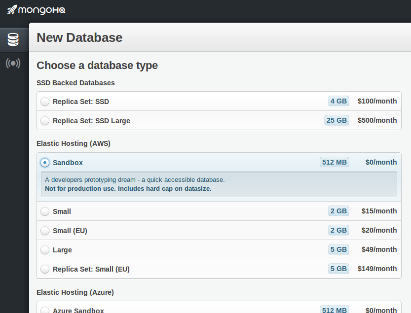

 After creating the database, you will be dropped into their database web console. Strider hasn't been configured yet, so there will be nothing there. Make sure to keep track of the MongoDB URI though, it will be used to configure Strider.

 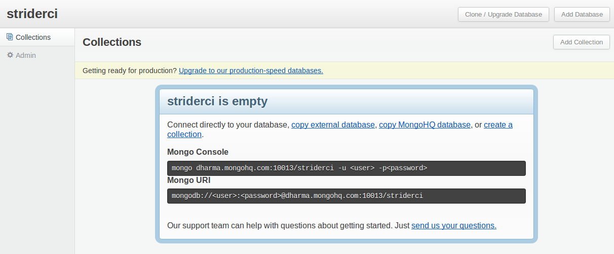

## Create a Github application

 For Github integration, we are going to need to create a Github application under our user account. This application will have [OAuth](http://oauth.net) tokens that will be used to authenticate your Strider instance with Github accounts. To register a Github application, go to the ["Register a new OAuth application"](https://github.com/settings/applications/new) page. I'm going to be using port 4000 for hosting my Strider instance, if you'd like a different port you will need to change your entries appropriately. Be sure to use your IP address as well.

 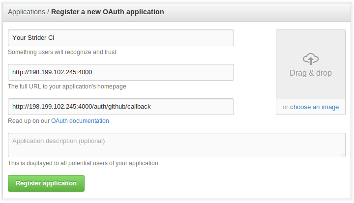

 After registering a new Github OAuth application, you will be taken to that application's control page. The control page will list the Client ID and Client Secret for the application. Be sure to keep track of these, because you will need them when configuring Strider.

 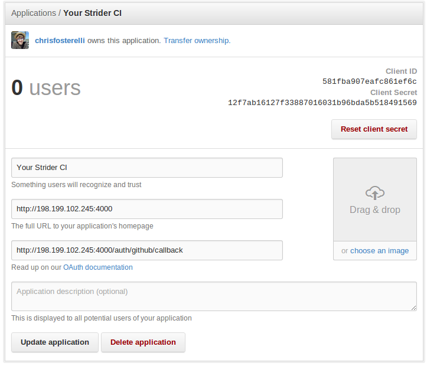

## Getting SMTP credentials

 In order for Strider to send our email notifications we will need access to SMTP server credentials. Just like with the MongoDB server, you may host your own if you'd like! In my case, I chose to go with [Mandrill](http://mandrill.com) for SMTP service. They provide a free tier as well, which should be more than sufficient for Strider's traditional needs. You can register an account with Mandrill on their [signup page](http://mandrill.com/signup/). After you have an account with Mandrill, you can navigate to their [SMTP & Credentials](https://mandrillapp.com/settings/index) section. There, you will find your SMTP credentials that you will use to configure Strider.
 
 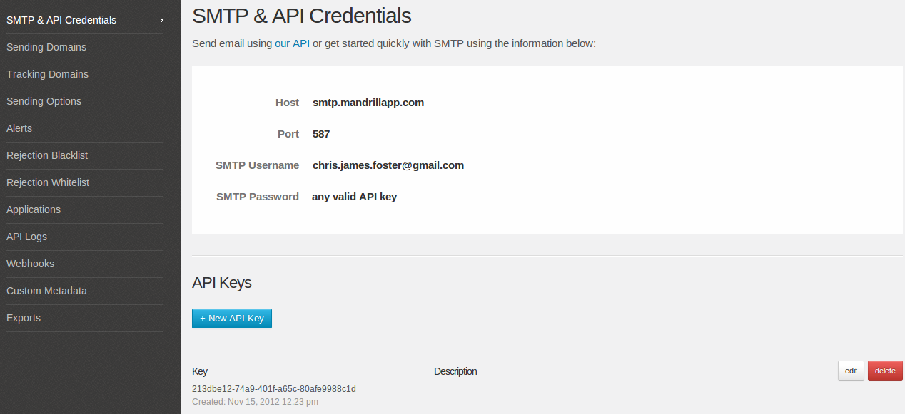

## Add an initial administrative user

 Before we go about starting Strider, we should create an initial administrative user. Without at least one user account, we can't log in. After you have the one administrative account, however, you can create more accounts and send invites through the web interface. We just need to create the one, and be sure to specify that it is an administrative user. You will need your MongoDB URI here.

    root@strider-ci:~# DB_URI="[Your MongoDB URI]" strider addUser
    email []: chris.james.foster@gmail.com
    Is admin? (y/n) [n]y
    Enter password []: ***********

    Email:		chris.james.foster@gmail.com
    Password:	****
    isAdmin:	y
    OK? (y/n) [y]y
    27 Jul 00:37:16 - info: Connecting to MongoDB URL: [Your MongoDB URI]
    27 Jul 00:37:17 - info: User added successfully! Enjoy.
    root@strider-ci:~# 

## Create the Strider Upstart job

 We are going to want to use Strider as a service, as this will make our life much easier on a server system. Recent versions of Ubuntu use [Upstart](http://upstart.ubuntu.com), so we will be creating an upstart job for Strider. This will allow us to daemonize Strider and provide us with start, stop, and status scripts. This is also where your configuration information that you collected earlier is going to be needed. Be sure to use your port and IP address. Also, ensure SERVER_NAME does **not** have a trailing slash.

 Use your favourite terminal text editor to create `/etc/init/strider.conf`:

    #!upstart
    description "Strider upstart job"

    start on startup
    stop on shutdown

    script
        export PORT=4000
        export DB_URI="[Your MongoDB URI]"
        export GITHUB_APP_ID="[Your Github Client ID]"
        export GITHUB_APP_SECRET="[Your Github Client Secret]"
        export SMTP_HOST="[Your SMTP Host]"
        export SMTP_PORT="[Your SMTP Port]"
        export SMTP_USER="[Your SMTP User]"
        export SMTP_PASS="[Your SMTP Pass]"
        export SERVER_NAME="http://198.199.107.142:4000"
        export STRIDER_CLONE_DEST="/home/strider/builds/"
        echo $$ > /var/run/strider.pid
        exec sudo -u strider \
         DB_URI=$DB_URI SERVER_NAME=$SERVER_NAME GITHUB_APP_ID=$GITHUB_APP_ID \
         GITHUB_APP_SECRET=$GITHUB_APP_SECRET SMTP_HOST=$SMTP_HOST SMTP_PORT=$SMTP_PORT \
         SMTP_USER=$SMTP_USER SMTP_PASS=$SMTP_PASS PORT=$PORT STRIDER_CLONE_DEST=$STRIDER_CLONE_DEST \
         strider >> /var/log/strider.log 2>&1
    end script

    pre-start script
        echo "[`date -u +%Y-%m-%dT%T.%3NZ`] (sys) Starting" >> /var/log/strider.log
    end script

    pre-stop script
        rm /var/run/strider.pid
        echo "[`date -u +%Y-%m-%dT%T.%3NZ`] (sys) Stopping" >> /var/log/strider.log
    end script

## Create a Strider user

If you happened to notice the references in the script above, we are going to be running Strider under a non-root user. In case of a security related issue in Strider, we don't want to be providing root access to an attacker. Let's create a separate user called "strider".

    root@strider-ci:~# adduser strider
    Adding user `strider' ...
    Adding new group `strider' (1000) ...
    Adding new user `strider' (1000) with group `strider' ...
    Creating home directory `/home/strider' ...
    Copying files from `/etc/skel' ...
    Enter new UNIX password: 
    Retype new UNIX password: 
    passwd: password updated successfully
    Changing the user information for strider
    Enter the new value, or press ENTER for the default
        Full Name []: 
        Room Number []: 
        Work Phone []: 
        Home Phone []: 
        Other []: 
    Is the information correct? [Y/n] 
    root@strider-ci:~# 

We should also disable password login for the "strider" user. You will still be able to login to that account via `sudo -u strider`, but this will disable anyone from logging into the account via password.

    root@strider-ci:~# passwd -l strider
    passwd: password expiry information changed.
    root@strider-ci:~# 
 
## Start Strider

If everything has gone right, it's now time to start up our Strider instance!

    root@strider-ci:~# start strider
    strider start/running, process 1229
    root@strider-ci:~# 

Later on, you can stop your Strider instance with the `stop` command, and see the status of it with the `status` command. Your log file for Strider will be in `/var/log/strider.log`, and you can check debugging output there. If anything went wrong, that is also were you will find the errors.

## Login to Strider

If everything went right, you should be able to open up your web browser and direct yourself to your Strider instance on your IP and port!

You will be able to login to your Strider instance with the email and password of the account that you created earlier, and the first page you see will be your dashboard.

 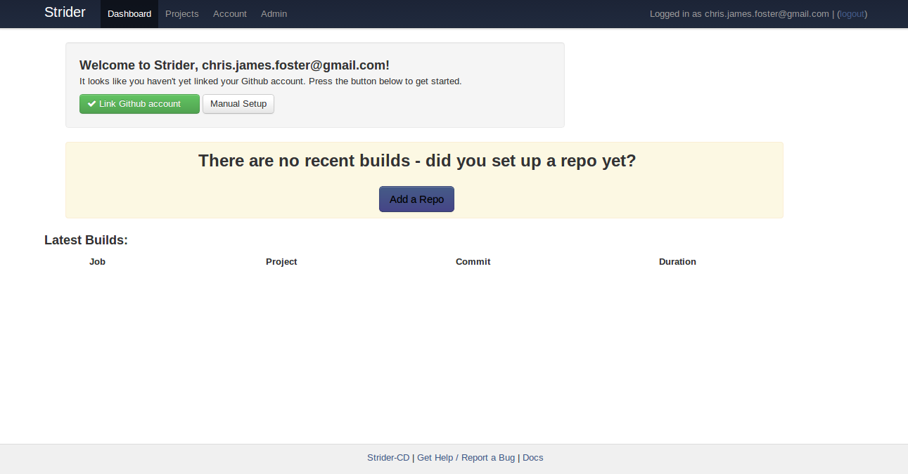

## Add a repository to Strider

Unfortunately, the dashboard won't be very interesting yet since we have not configured any repositories to run tests on. The easiest way to add a repository will be to directly connect with your Github account. You should get an OAuth permissions dialogue upon clicking the link.

 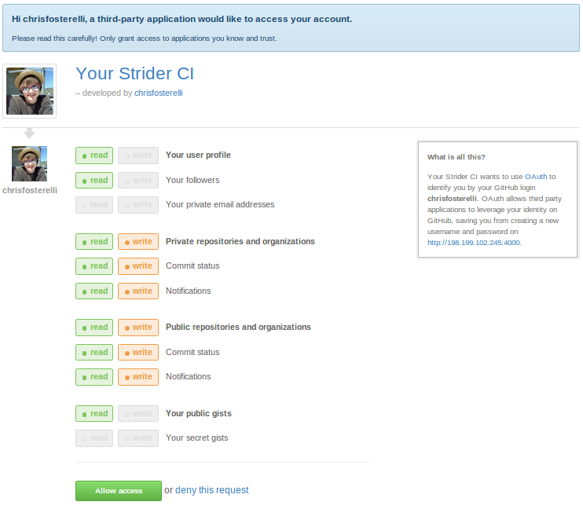

If you run into issues with connecting your Github account, you have likely made an error in your Github application settings or your Strider environment variables. The hosts need to match exactly. The screenshots in the sections above can help you with what that should look like if you get stuck.

Assuming all is well though, you should see a list of the applications under your account!

 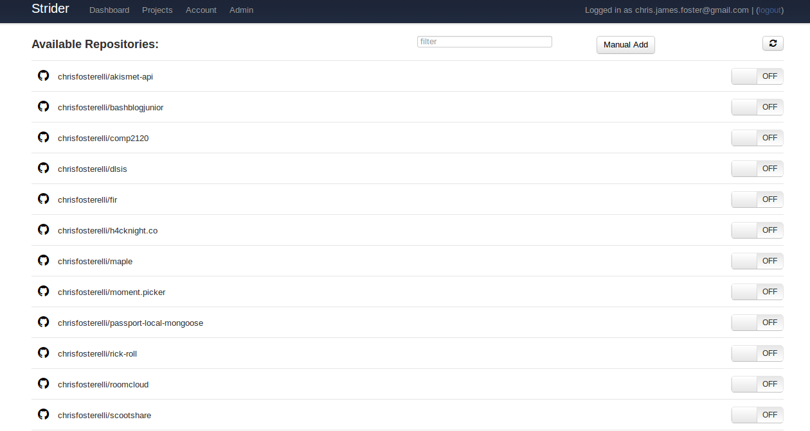

Go ahead and add one. Strider will automatically set up all the necessary hooks, and immediately run your first test. You'll be able to see the test status on the dashboard, and you'll recieve an email notification when the test completes. For a nodejs application, Strider will automatically run `npm test`. You can configure this to run a separate command, see their docs for more information.

 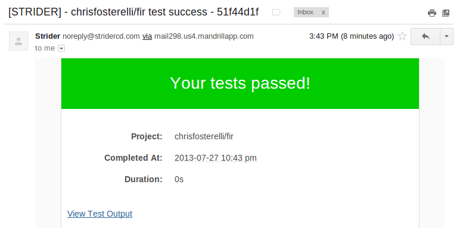

## Conclusion

At this point you might want to make a snapshot of your droplet, if you're using Digital Ocean's hosting. This will allow you to roll back to that point, or spin up additional copies of that image later on with different resources.

You can now begin to explore all of Strider's features. You'll likely want to invites other users to your instance, and you can send them email invitations through the administrative interface. You can also set up Heroku deploy keys so that your builds will automatically deploy.

As Strider is under heavy development, new features and bug fixes will likely be coming out in the near future. You can update your Strider installation at any time by logging into the instance and running `npm update -g strider` as root.

And with that, you should be all set! Strider is an exciting new CI/CD that looks like it has a promising future. If you have any issues or questions with the setup, send me an email at [chris.james.foster@gmail.com](mailto:chris.james.foster@gmail.com).

